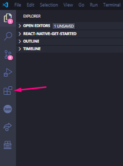
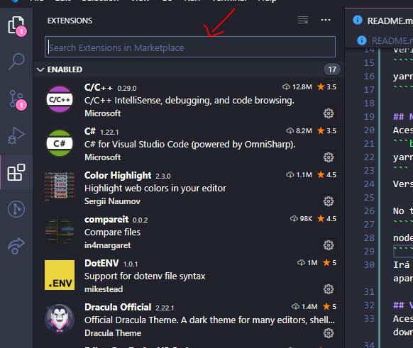
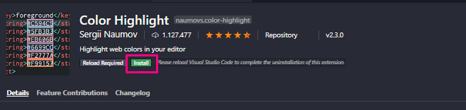
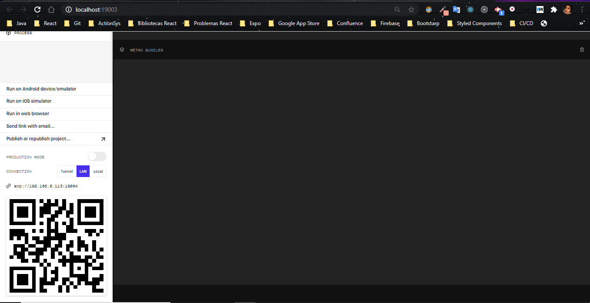
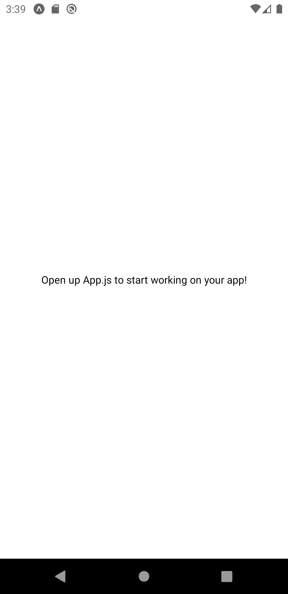

<h1 align="center">
  
</h1>

<p align="center">O projeto foi criado para ser utilizado como guia (configurar de ambiente para desenvolvimento), visão geral sobre React e por fim apresentação de uma aplicação de listagem de pessoas.</p>

# Funcionalidades

- [x] Listagem de pessoas
- [x] Acessar perfil de uma pessoa

<h1 align="center">
  
  
</h1>

# 🛠 Tecnologias

As seguintes ferramentas foram usadas na construção do projeto:

- [Expo](https://expo.io/)
- [Node.js](https://nodejs.org/en/)
- [React](https://pt-br.reactjs.org/)
- [React Native](https://reactnative.dev/)
- [JavaScript](https://www.javascript.com/)

# 🖥️ Pré-requisitos

Antes de começar, você vai precisar ter instalado em sua máquina as seguintes ferramentas: `Node.js`, `Yarn`, `Expo` e `VSCode`

# 🛠️ Instalando ferramentas

## Yarn

Acesse como administrador o power shell do windows e execute o seguinte comando:

```bash
npm install -g yarn
```

Será feita a isntalação de forma global.

Verifique a versão

```bash
yarn -v
```

## Node.js

Acesse o cmd e digte:

```bash
yarn install nodejs-lts
```

`Versão lts é mais estável de bugs e erros do que a current (recente)`

No terminal digite uma das opções abaixo:

```bash
node -v ou npm -v
```

Sera retornado a versão instalada em sua maquina, caso não aparece, é porque não foi instalado.

## VSCode

Acesse [Visual Code](https://code.visualstudio.com/Download), faça o download e instale conforme seu sistema.

#### Extensões VSCode

Abra o VScode e no lado esquerdo clique na seguinte opção:



Terá uma barra de pesquisar



Procure por:

- Dracula Official
- Color Highlight.
- Material Icon Theme.

  > Precisa fechar e abrir novamente o VScode para ficar visível a extensão.

- Rocketseat React Native.
- Rocketseat ReactJS.
  > Opcional essas últimas extensões.

#### Instalando extensões

Clique na opção install (em verde):



## Expo

Pode ser feita a instalação do expo de duas formas:

```bash
yarn global add expo-cli
```

ou

```bash
npm install -g expo-cli
```

# Criando/Executando o Projeto

**Acesse terminal (CMD)**

```bash
# Criar um projeto react native/expo
$ expo init random-peoples
# Em seguinda sera solicitado o template que deseja utilizar, somente pressione enter.`

# Entre no repositório
$ cd random-peoples

# Instale as depedencias
$ yarn install

# Inicie o projeto
$ expo start

```

Será aberta uma aba no seu navegador padrão, conforme imagem abaixo.



Agora e preciso executar o projeto no seu celular, para isso, acesse a Playstore ou AppStore e baixE o aplicativo `Expo`, ao abrir o aplicativo, clique em `Scan QR Code` e escaneie o QR da tela que foi aberta em seu navegador.
Aguarde até que aparece uma tela igual a essa:



Até aqui, já configuramos todo o ambiente necessario para iniciamos o desenvolvimento, a baixo sera apresentado de forma resumida alguns topicos que serão abordados no treinamento.

# Conceitos React

## O que e react?

React e um ferramenta criada pelo facebook, seu intuito e facilitar o desenvolvimento de aplicacões web ( React JS) e mobile (React Native), utiliza como linguagem de desenvolvimento javascript.

O React fornece também o React Native, com ele e possivel criar aplicações hibridas que funcionam tanto no Android como no iOs.

E umas das ferramentas utilizadas por grandes empresas, como Uber, Netflix, WhatsApp.

Um dos pontos interessantes é que você aprende uma vez os conceitos obtidos no React JS ou React Native e utiliza a mesma base para os dois.

# Componente

Um componente e uma parte visual da sua aplicação, seriam pedaços de informações que compõe uma tela.


1. Header (vermelho) - contém o titulo da aplicação
2. ListPeoples (Amarelo) - exibe a lista de pessoas

# Props

Props `(propriedades)` são valores que podem ser passados para um componentes, podem ser string, númerico, até mesmo uma função, esses valores podem ser usados pelo componente que recebe e utilizados para alguma regra, esses valores somente pode ser lidos e `não alterados.`

# State

State seriam variaveis utilizadas dentro de um componente que podem ser `(alteradas)`

# Ciclo de vida

Ciclo de vida seria fases que um componente tem, assim como uma pessoal, ela nasce, cresce e morre, com componente seria da mesma forma, mas utilizariamos outras expressões, como, montado, atualizado e desmotado.Seguindo esses conceitos podemos executar determinado código em momentos particulares do processo. 


# Contribuição

<table>
  <tr>
    <td align="center"><a href="https://github.com/kujikeo"><br /><sub><b>Guilherme Machado</sub></a><br /><a href="https://github.com/kujikeo" title="Rocketseat">👨‍🚀</a></td>
    <td align="center"><a href="https://github.com/daviddossantos"><br /><sub><b>David Cruz</b></sub></a><br /><a href="https://github.com/daviddossantos" title="David Cruz">👨‍🚀</a></td>
  </tr>
</table>
